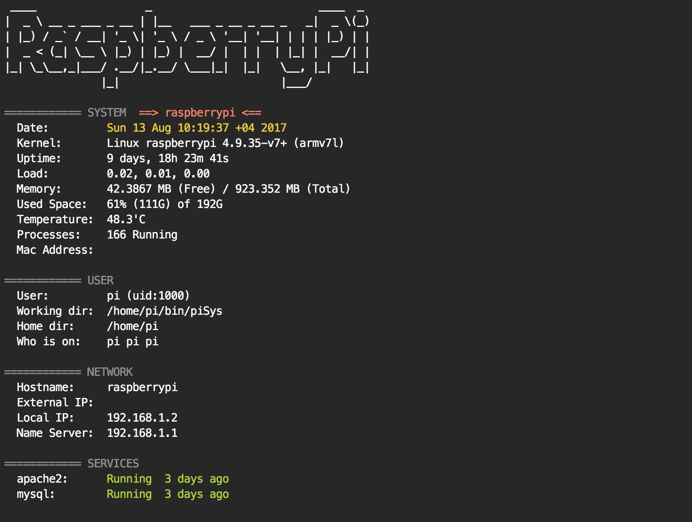

# piSys
Open terminal prompt, ssh to your Raspberry Pi device and use this script sys.sh to quickly view system information about the Raspbian OS running on your Raspberry Pi 

### Screenshot 



### Installation
ssh to your Raspberry Pi devic and run the following command to install the script
```bash
$ git clone https://github.com/ffares/piSys.git
$ cd piSys
```


### Usage
Using this script is very simple, just run this from the commnd line:

```bash
$ ./sys.sh
```
