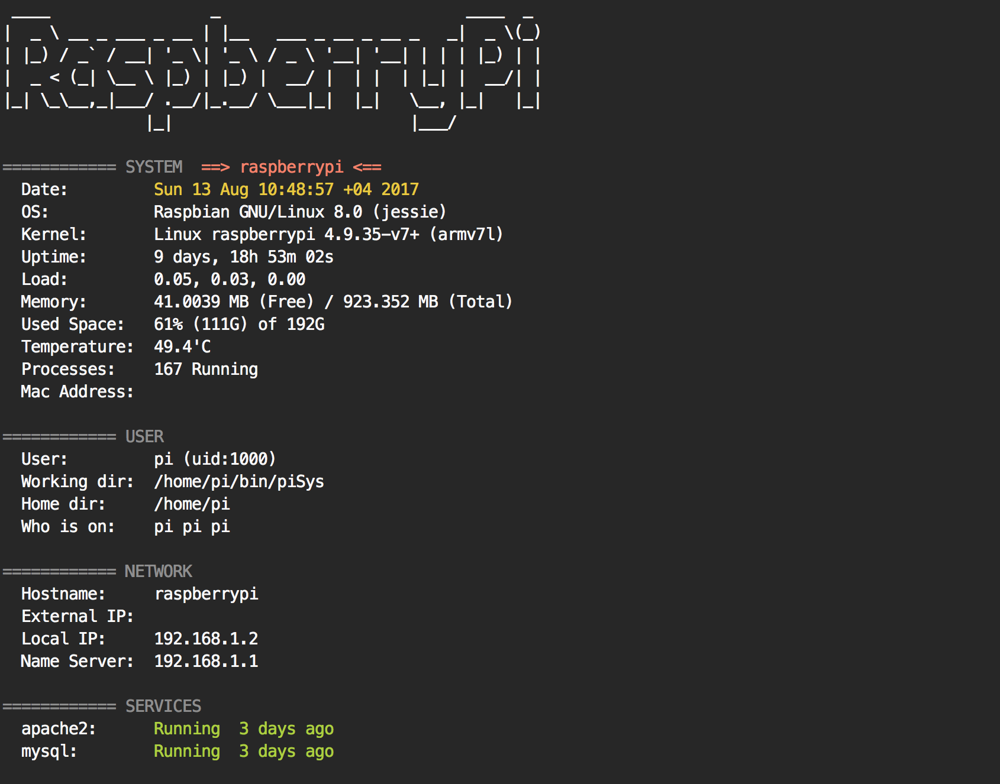

# piSys
Shell script shows your Raspberry Pi system information from the command line. 

### Screenshot 



### Installation
```bash
$ git clone https://github.com/ffares/piSys.git
$ cd piSys
```


### Usage
Using this script is very simple, just run this from the commnd line:

```bash
$ ./sys.sh
```
